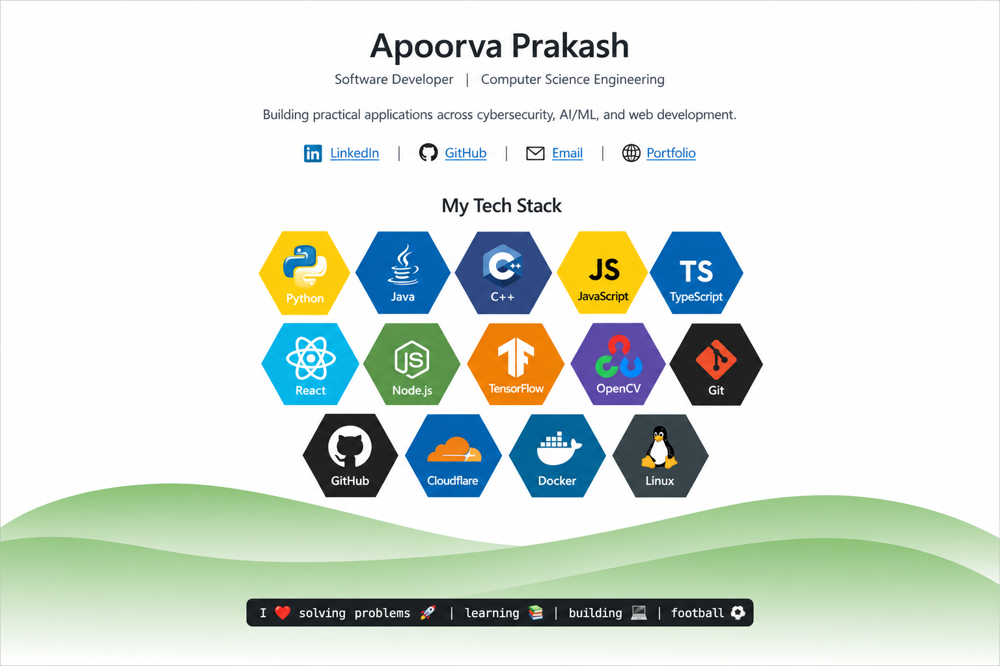

  <a href="https://www.linkedin.com/in/apoorvaprakash2004">LinkedIn</a>
  &nbsp; | &nbsp;
  <a href="https://github.com/APRO-75">GitHub</a>
  &nbsp; | &nbsp;
  <a href="mailto:ap75ro@gmail.com">Email</a>
  &nbsp; | &nbsp;
  <a href="https://github.com/APRO-75/WinXp_Portfolio">Portfolio</a>

---

<h2 align="center">Featured Projects</h2>

  
  
  

  
  
  

---

<h2 align="center">Research & Certifications</h2>

  <a href="https://doi.org/10.1109/PuneCon67554.2025.11379312">
    IEEE PuneCon 2025
  </a>
  &nbsp; | &nbsp;
  <a href="https://archive.nptel.ac.in/content/noc/NOC25/SEM2/Ecertificates/106/noc25-cs116/Course/NPTEL25CS116S65400928810377974.pdf">
    NPTEL Cyber Security and Privacy
  </a>

---

  <a href="https://github.com/APRO-75?tab=repositories">View All Repositories</a>

